# **Este é o guia para o Lab de Data & AI para aqueles que chegaram atrasados na sessão**
Caso você não esteja atrasado acompanhe o guia complexo do Lab [aqui](./data_ai/readme.md)

**Resource Manager**

Serviço que permite a automatização do provisionamento de infraestrutura no OCI através de Terraform.

Pode ser utilizando tanto para importar e criar uma infraestrutura nova de arquivos Terraform, quanto para exportar, como arquivos Terraform, uma estrutura já configurada em um determinado compartimento.

Através dele é possível realizar os jobs do Terraform: Plan, Apply, Destroy e Import State.

Documentação: https://docs.oracle.com/en-us/iaas/Content/ResourceManager/home.htm

**Pré-requisito: Namespace do Object Storage**

Nesta etapa, coletar o Namespace do object storage do seu ambiente. Esta informação é bastante relevante, pois será utilizada nas etapas de configuração do nosso script python.

Para visualizar e anotar o Namespace do seu ambiente, acesse o menu com seu avatar de usuário no canto superior direito, e clique no nome do seu Tenancy:

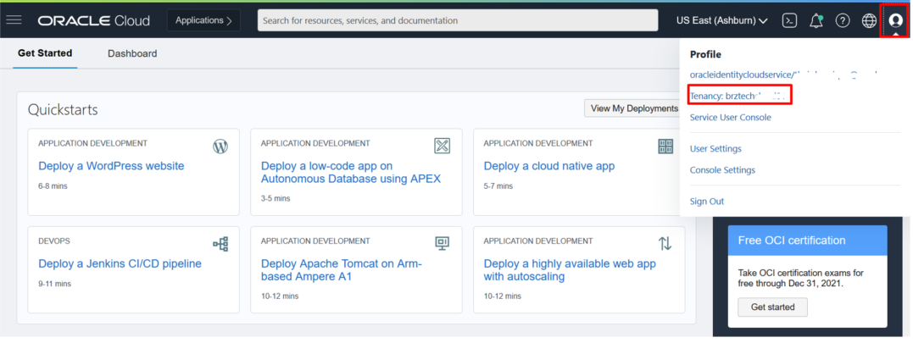

Agora nas informações do seu Tenancy, podemos encontrar e tomar nota do Object storage Namespace.

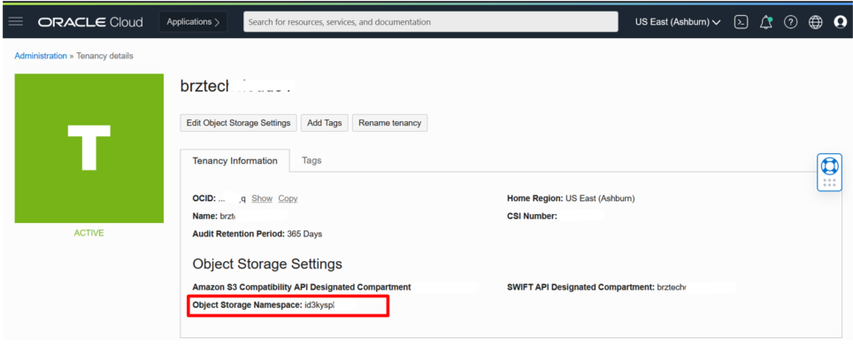

**Reserve o Namespace em um notepad ou editor de sua preferência. Vamos utilizar na próxima etapa**

**Demonstração**

Importar as configurações de Terraform para o resource manager e executar os jobs de Plan e Apply.

_Download_

Faça o download do arquivo .zip aqui.

Em seguida descompacte o arquivo e localiza o arquivo chamado: **df\_airbnb-rio.py** em seguida abra o arquivo com o editor de texto de sua preferência.

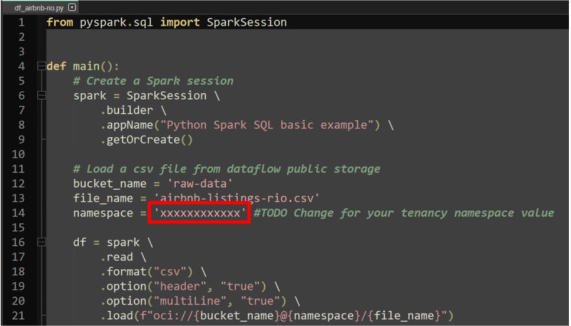

Localize o campo _namespace_ e substitua o valor entre aspas simples pelo Namespace do Object Storage da sua Tenancy que você havia reservado na etapa anterior.

Após isso salve o arquivo e compacte novamente os arquivos como indicado na imagem abaixo:

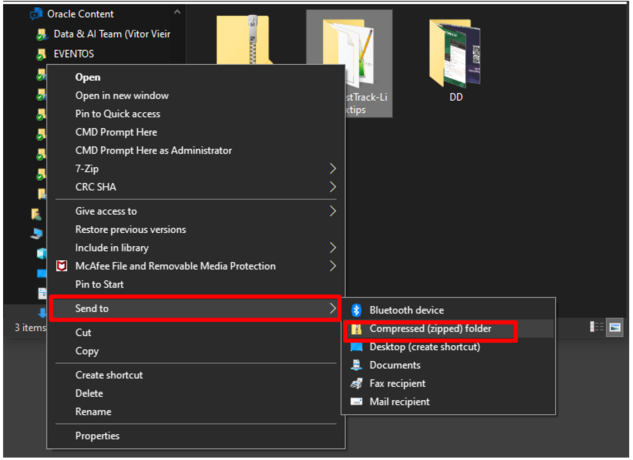

Navegue no menu do OCI Developer -> Services  Resource Manager -> Stacks

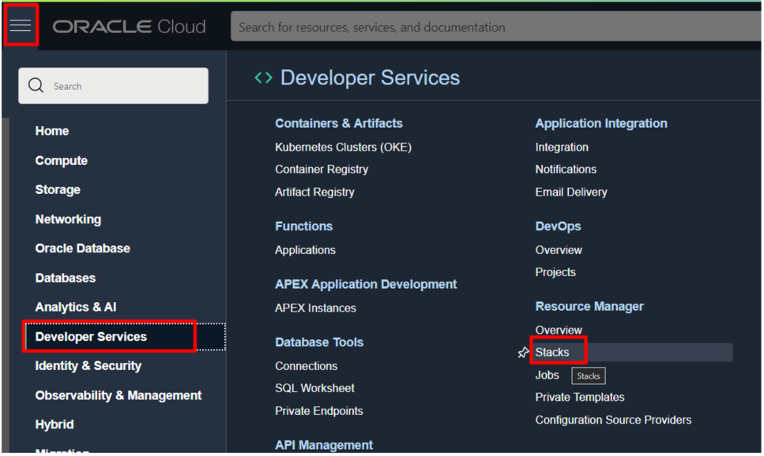

Crie uma nova Stack

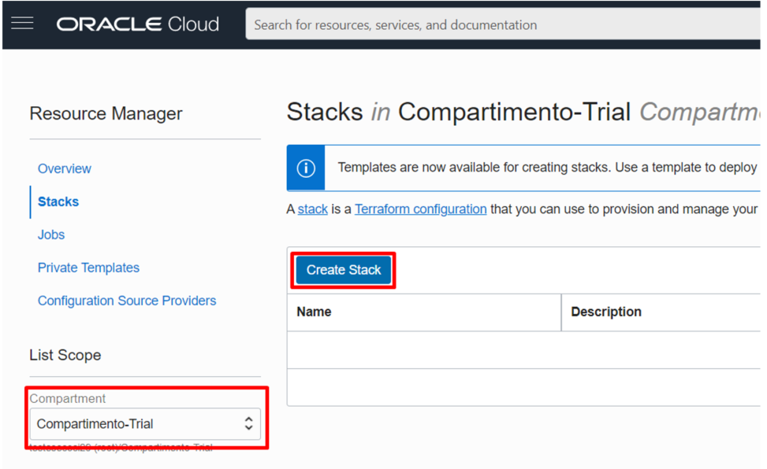

Selecionando My Configuration, Zip File e selecione o arquivo zip que você acabou de configurar na etapa anterior. Em seguida clique em Next

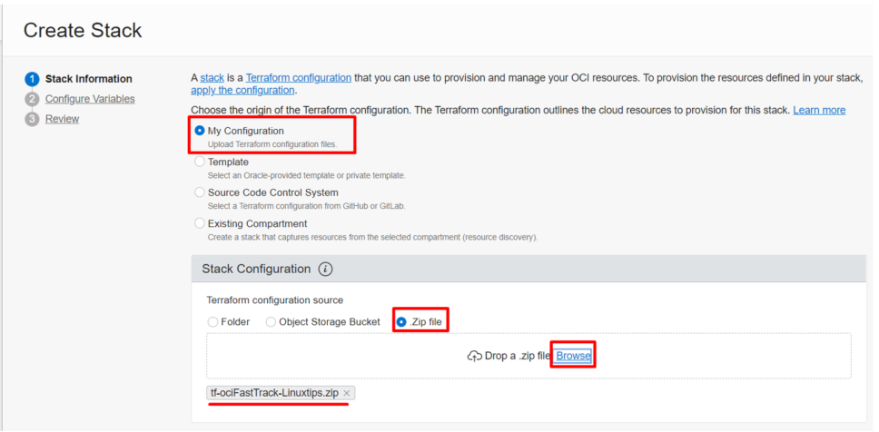

Verifique se o Compartment correto está selecionado e clique em Next novamente

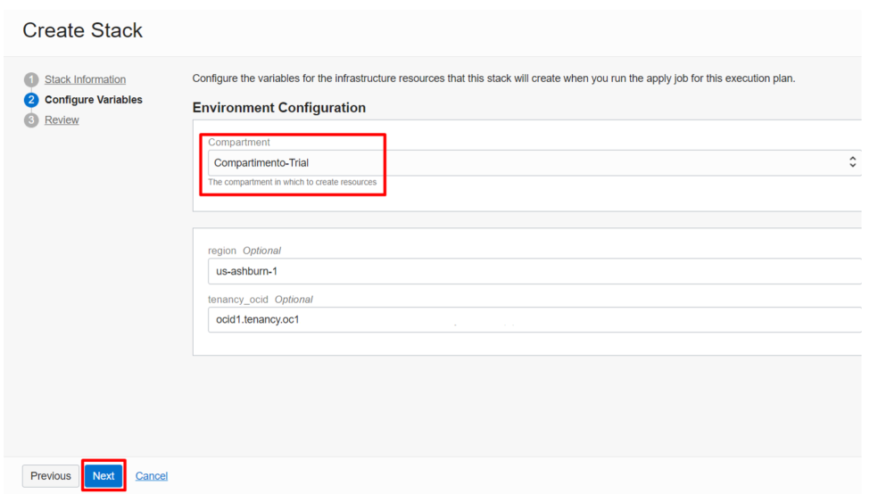

Em seguida selecione "Run Apply" e clique em create.

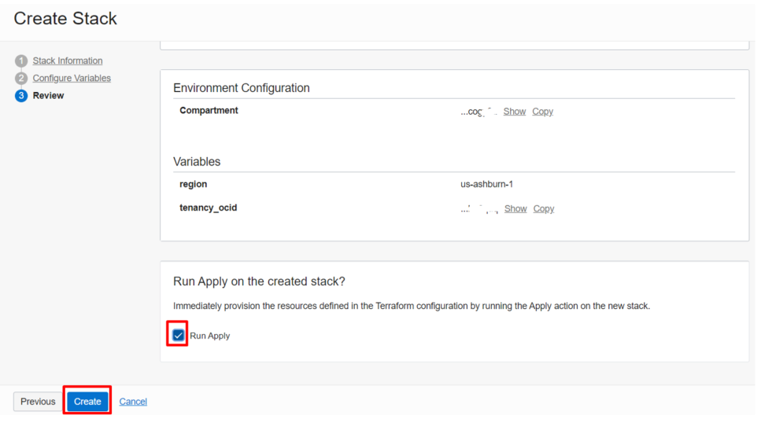

Pronto! Seus recursos serão provisionados

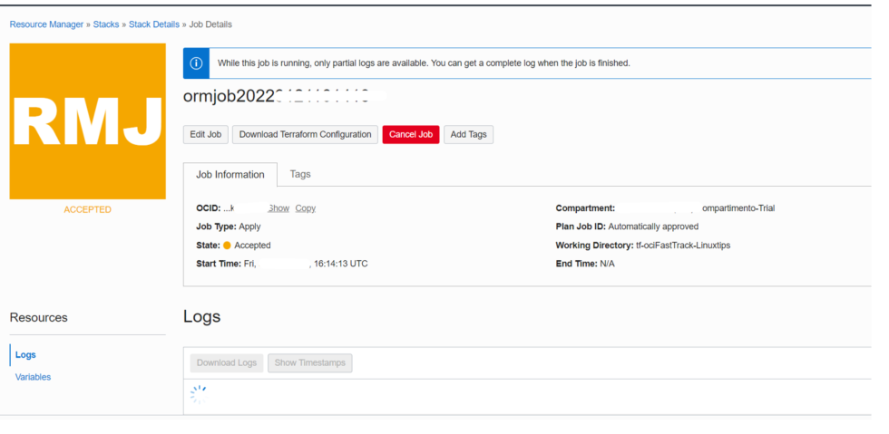

Após completar as etapas, acesso o recurso de Data Flow e verifique a execução de sua aplicação Spark no Data Flow. Menu de Serviços -> Analytics & AI -> Data Flow.

Ao final da tela, clique na execução

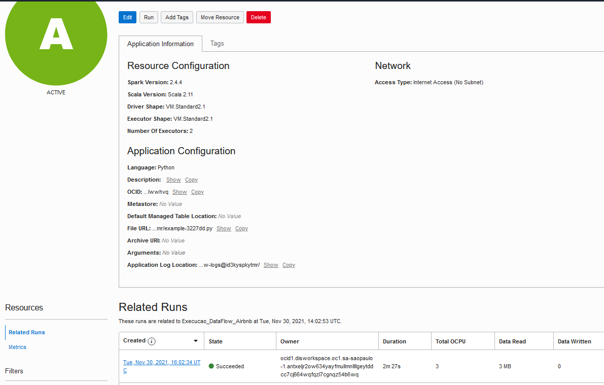

Aguarde o término da execução. Quando concluída, no canto inferior esquerdo clique em logs. Em seguida clique no resultado da execução com o nome de "spark_application_stdout.log.gz"

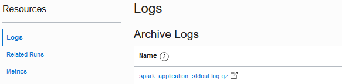

Uma nova aba deve ser aberta com o conteúdo dos dados processado. Caso não seja aberta uma nova aba com o conteúdo, mas seja realizado o download do arquivo, abra-o em algum editor de texto de sua preferência. Para ambos os casos o resultado da saída deve ser semelhante ao abaixo:

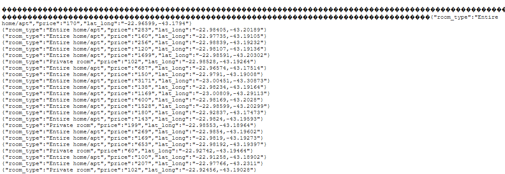

Com isso concluímos este lab.