# **Este é o guia para o Lab de Data & AI**
Caso você esteja chegando atrasado para este Lab e não pegou o início da sessão clique [aqui](/Cheguei_Atrasado/readme.md)

## **Pré-requisitos**

Nesta etapa criar alguns recursos necessários para a criação do Data Flow Application.

## Verificação dos buckets necessários

Verifique se você possui os seguintes buckets no object storage

- dataflow-logs
- dataflow-warehouse
- raw-data

Acesse ao **menu** **-> Storage -> Buckets**. Em seguida verifique se você está no compartment correto (Compartimento-Trial) e lá você a lista com os seues buckets

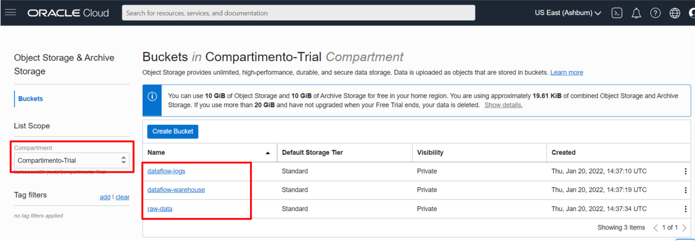

## Verificação da VCN

Verifique se a sua VCN está criada

Acesse ao **menu** **-> Networking -> Virtual Cloud Networks**. Em seguida verifique se você está no compartment correto (Compartimento-Trial) e lá você verá a sua VCN (VCN-Trial)

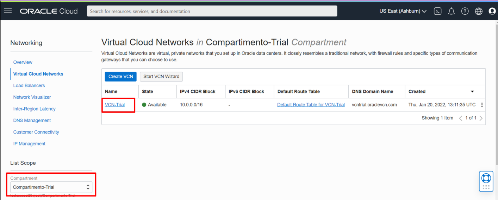

## Identificação do Namespace do object storage

Nesta etapa, coletar o Namespace do object storage do seu ambiente. Esta informação é bastante relevante, pois será utilizada nas etapas de configuração do nosso script python.

Para visualizar e anotar o Namespace do seu ambiente, acesse o menu com seu avatar de usuário no canto superior direito, e clique no nome do seu Tenancy:

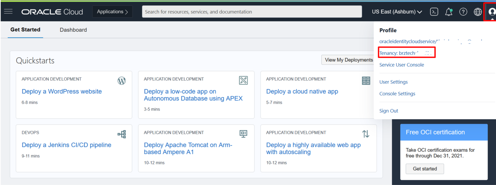

Agora nas informações do seu Tenancy, podemos encontar e tomar nota do Object storage Namespace.

**Guarde o nome do Namespace em um notepad ou editor de sua preferência.**

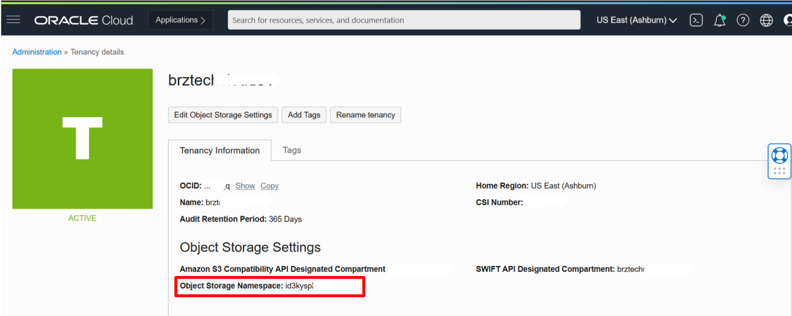

## Download dos arquivos utilizados

Durante este LAB iremos utilizar dos arquivos, o script python **df\_airbnb-rio.py** e o dataset **airbnb-listings-rio.csv** estes arquivos foram disponibilizados em conjunto com os demais arquivos disponíveis no evento, porém caso necessário, poderão também ser encontrados nos links citados abaixo.

## **Download do Script Python e do Dataset**

Acesse a seguinte URL (https://github.com/CeInnovationTeam/OCI-Fast-Track-Linuxtips/raw/main/Data%26AI/Cheguei_Atrasado/tf-ociFastTrack-Linuxtips.zip) e faça o download do script python e do Dataset

**Salve os arquivos em um diretório de sua preferência.**

# **Configurando o script python**

Abra o arquivo **df\_airbnb-rio.py** com o edito de texto de sua preferência.

Dentro do script, localize a entrada "namespace". Em seguida substitua a valor do indicado no arquivo pelo Namespace do Object Storage que você reservou na etapa anterior.

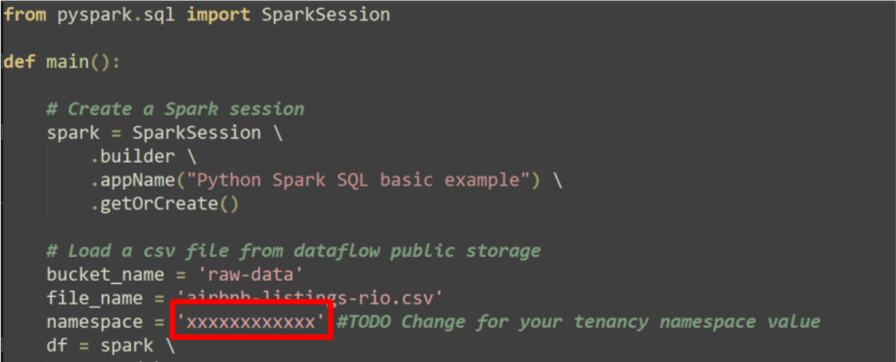

Após alterar salve as alterações realizadas.

# **Transferindo arquivos utilizados para os buckets**

##

## Nesta atividade utilizaremos a própria UI do OCI para fazer o upload dos arquivos para os buckets corretos no object storage.

## Transferindo o script Python para o bucket

Acesse ao **menu** **-> Storage -> Buckets**. Em seguida verifique se você está no compartment correto (Compartimento-Trial) e lá você a lista com os seus buckets

Acesse o **dataflow-warehouse** , e clique no botão **UPLOAD**

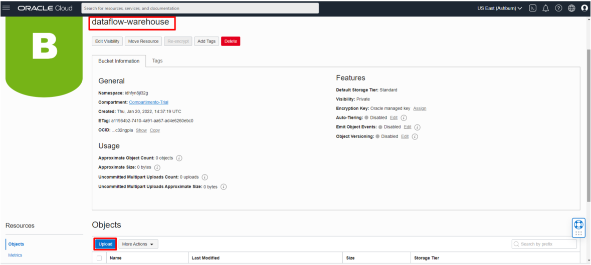

Clique em "select \_files" e selecione o dataset do **df\_airbnb-rio.py** que você baixou na etapa anterior, depois clique no botão Upload

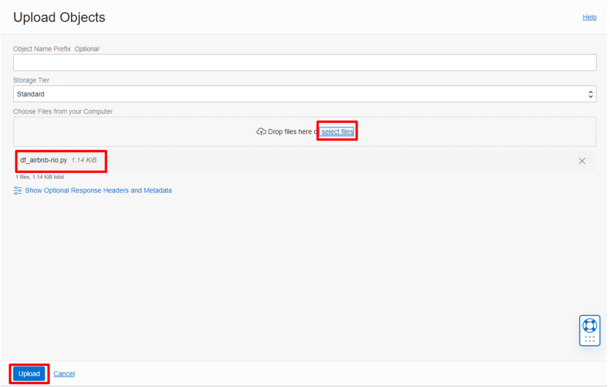

## Após a conclusão do upload clique no botão Close

##

##

## Transferindo o Dataset para o bucket

Acesse ao **menu** **-> Storage -> Buckets**. Em seguida verifique se você está no compartment correto (Compartimento-Trial) e lá você a lista com os seus buckets

Acesse o **raw-data** , e clique no botão **UPLOAD**

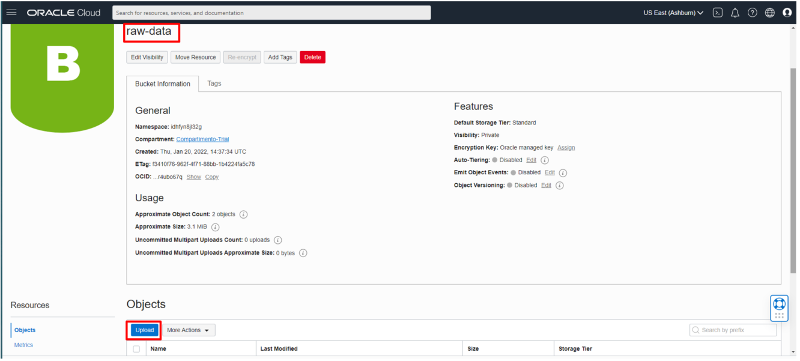

Clique em select e selecione o dataset do **airbnb-listings-rio.csv** que você baixou na etapa anterior, depois clique no botão Upload

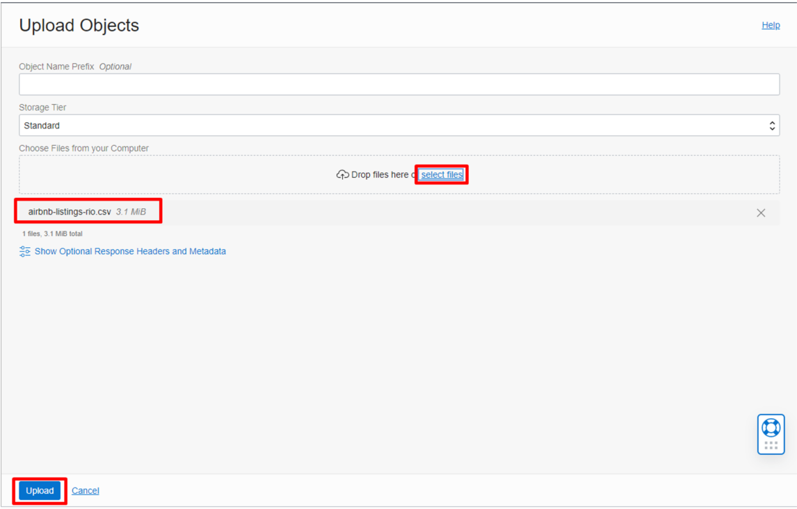

## Após a conclusão do upload clique no botão Close

# **Criando sua primeira Dataflow Application**

Neste passo iremos criar nossa primeira Dataflow application. O objetivo desta application será tranformar o dataset iris.csv em um arquivo no formato parquet, que poderá ser consumido por outras ferramentas.

A console do serviço Data Flow pode ser acessada atavés do **menu** **-> Analytics &amp; AI -> Data Flow**

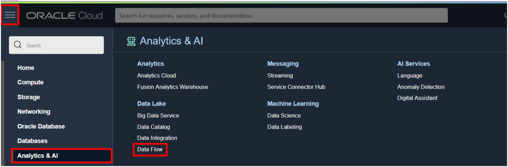

Dentro da console do Dataflow, vamos clicar em "Create Application"

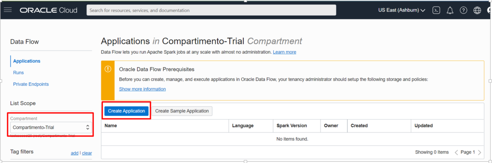

Após clicar no botão, iremos fornecer as informações básicas para criação de nossa primeira aplicação

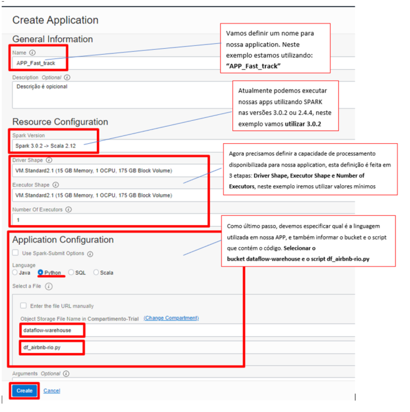

# **Executando sua primeira Application - "Run"**

Após criação de sua "Dataflow App", agora podemos executar o código quantas vezes necessário através do botão RUN na console ou através de linha de comando com OCI CLI / API

Neste exemplo iremos executar o script Application "APP\_Fast\_track", através da console:

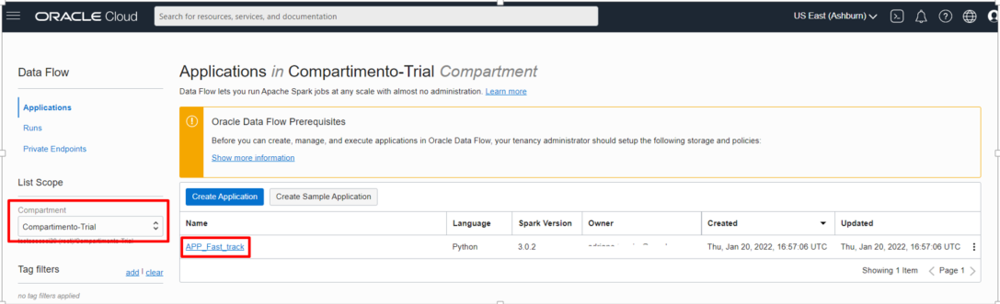

Dentro da Application criada, podemos encontrar diversas informações relacionadas a aplicação, além do botão "RUN" que iremos acionar para uma nova execução:

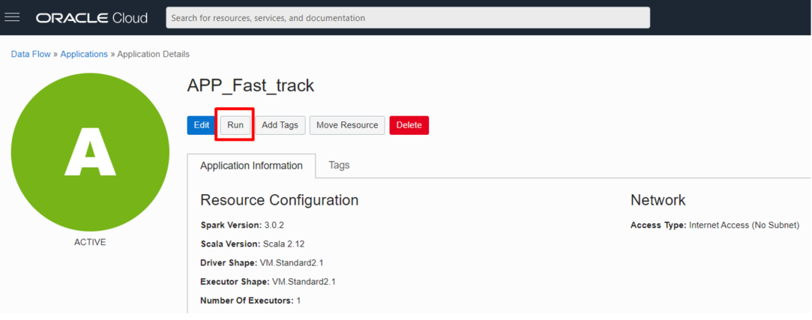

Para cada execução podemos definir individualmente os parâmetros relacionados a infraestrutura alocada ou argumentos.

Para nossa execução, não será necessário nenhum tipo de alteração, somente clicar em **"Run"**

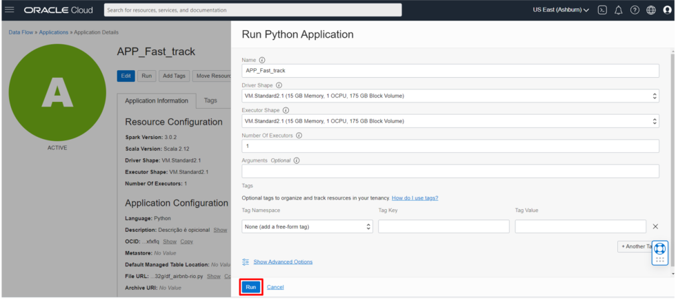

Em seguida você será direcionado a página de Runs, como no imagem abaixo

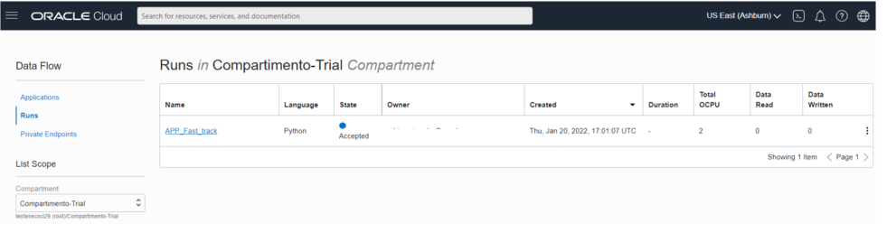

# **Verificando Logs e o resultado esperado**

O OCI Data Flow registra automaticamente os logs de erro dos nodes driver e executors no bucket dataflow-logs, os logs de stderr e stdout são gerados a cada execução em dois arquivos .gz diferentes.

Os logs ficam listadas a cada "Run" das Applications, porém esta exibição não ocorre de imediato. Caso necessário verificar uma log que ainda não esteja sendo exibida na **console de execução** , podemos também verificar esses logs diretamente no **bucket dataflow-logs**.

Após a conclusão da execução da aplicação spark, clique sobre o log "spark_application_stdout.log.gz"

Uma nova aba deve ser aberta com o conteúdo dos dados processado. Caso não seja aberta uma nova aba com o conteúdo, mas seja realizado o download do arquivo, abra-o em algum editor de texto de sua preferência. Para ambos os casos o resultado da saída deve ser semelhante ao abaixo:

Com isso concluímos este lab.