# Lab 4. Serviços de Armazenamento em Nuvem

**Block Storage**

Objetivos

> • Crie um volume de Block Storage de 500GB e anexe o Block Storage a
> uma Instância de Computação

**Criando volumes de Block Storage**

Você pode criar volumes de Block Storage por meio da interface "Block
Storage".

# [EXERCÍCIO 4: Criando um volume de Block Storage]
**PASSO 1 -** Para acessá-lo: No menu principal, você escolhe Block   
Storage, depois "Block Volume".                                       
                                                                      
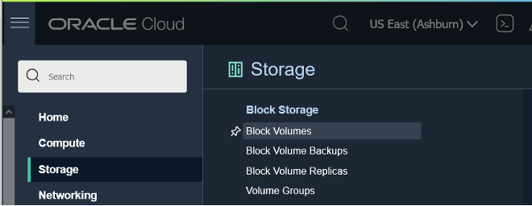
                                                                      
**PASSO 2 -** O processo de criação do volume do bloco é muito        
simples, você só precisa clicar em \"Create Block Volume\" e          
preencher as informações solicitadas:                                 
                                                                      
> **Name: block_vol500GB**                                            
>                                                                     
> **Create in Compartment**: \<Your Compartment\>                     
>                                                                     
> **Virtual Cloud Network**: \<Your VCN\>                             
>                                                                     
> **Availability Domain**: AD 1                                       
>                                                                     
> **Size**: 500 GB                                                    
>                                                                     
> **Backup Policy**: Bronze                                       
>                                                                     
> **Volume Performance**: Balanced                                    
                                                                       
 -   **IMPORTANTE**: O Block Storage **NECESSITA** estar no mesmo      
     domínio de disponibilidade (AD) da Instância de Computação que    
     será anexado. No caso iremos anexá-lo à VM Linux 1 criada no      
     AD 1. portanto **certifique-se que Block Volume está no mesmo AD  
     da sua VM.**                                                      
                                                                       
 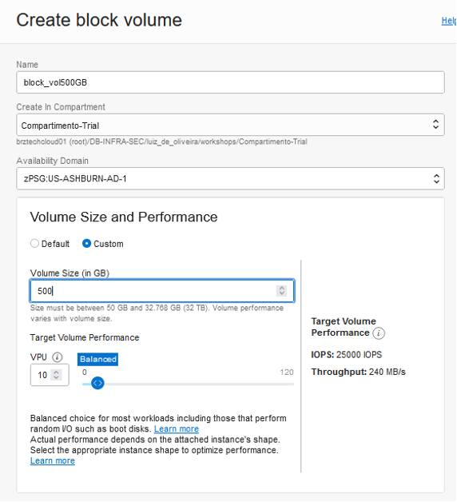
                                                                       
 Após a configuração, o OCI começará o provisionamento. O tempo de     
 provisionamento depende do tamanho do volume.                                                                                                                                                  
                                                                       
 **Conectando Block Volume a uma Instância de Computação**             
                                                                       
 **PASSO 3 -** Para conectar Block Volumes a instâncias de computação, 
 você precisa acessar a tela inicial \"Compute Instance\" e, na página 
 de detalhes da VM, clicar em \"Attach Block Volume\".                 
                                                                       
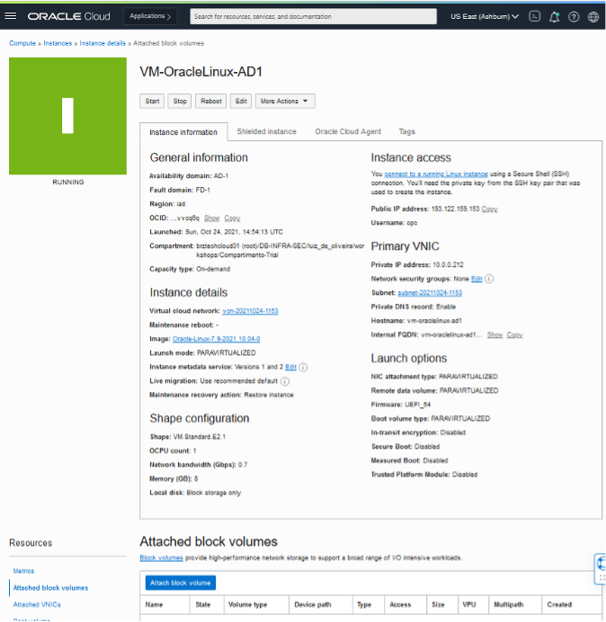                                     
                                                                       
 **PASSO 4 -** Aanexe o Block Volume de 500 GB                         
 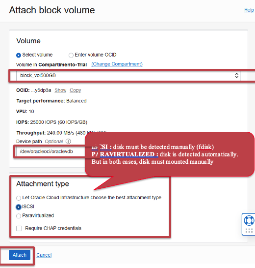 
                                                                       
 Assim que o disco estiver devidamente conectado, podemos montá-lo na  
 instância de computação.                                              
                                                                       
 **PASSO 5 -** Para facilitar o processo de anexação de disco, o       
 Oracle Cloud Infrastructure fornece os comandos necessários para      
 detectar o novo disco da VM. No lado direito das informações do       
 disco, você encontrará um menu de três pontos.                        
                                                                       
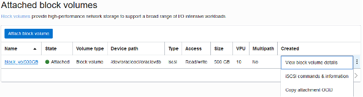                                  
                                                                       
 Se você escolher "iSCSI Commands & Information", obterá os comandos   
 necessários para detectar o disco recém-criado:                       
                                                                       
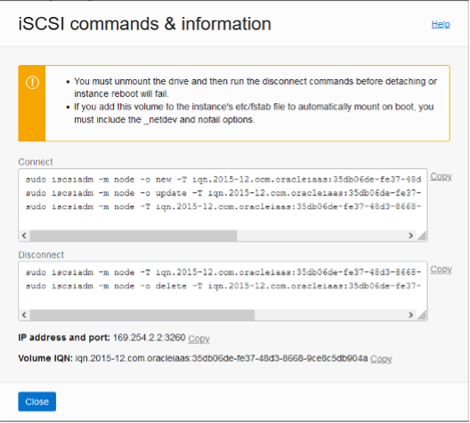                                 
                                                                       
                                                             
                                                                       
**PASSO 6 -** Execute o procedimento para o Block Volume de 500 GB.   
                                                                       
 ### Tudo que você precisa fazer é copiar os comandos e executá-los no servidor Linux.                                                               
 Após a detecção do disco, você precisa formatar e montar o novo disco: 
                                                                       
 ### Como detectar e mapear discos novos no Linux                      
                                                                       
 ### 1 -- Conecte-se ao Servidor VM-OracleLinux-AD1 como usuário opc conforme feito no LAB 3 
                                                                       
 ### 2 -- Se torne ROOT user através do comando SUDO: 
 *"\$* sudo su - *"* 
                                                                       
 ### 3 -- Execute o "ATTACH commands" copiado do "iSCSI Commands & Information": 
                                                                       
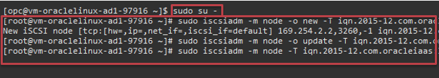                                                                         
                                                                       
 ### 4 -- Detecte o novo dispositivo com o comando: 
 *"\$* fdisk -l *"* 
 
 Você verá a seguinte informação:  
                                                                       
  
                                                                                                                
                                                                       
 ### 5 -- Formate o disco com o comando: 
 "mkfs /dev/sdb"           
                                                                       
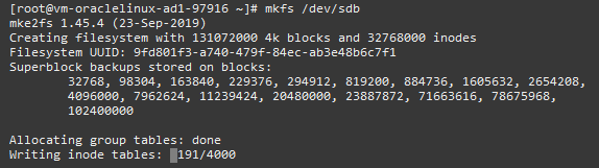  
                                                                       
 ### 6 -- Após o disco ter sido formatado, crie um diretório dentro do linux para ser usado como um ponto de montagem para o novo volume de disco com o comando: 
 *"*mkdir /vol500g*"*  
                                                                       
 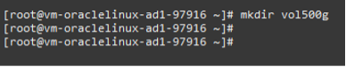  
                                                                       
 ### 7 -- Monte o novo volume de disco com o comando: 
 "mount /dev/sdb /vol500g"
 
 e cheque se o disco está disponível com o comando: 
 
 "df -h"  
                                                                       
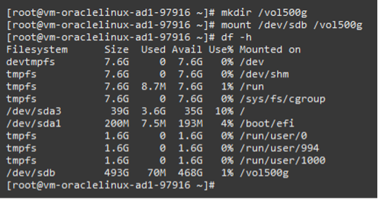  

**Configurando Políticas de Backup para Block Storage**

Objetivos

-   Criar Políticas de Backup

No Oracle Cloud Infrastructure, Block Volume (incluindo volumes de
inicialização -- Boot Volumes) e backups Compute Nodes são
independentes. As políticas de backup podem ser definidas na página
inicial do Block Storage (Menu Principal\> Block Storage\> Block
Volumes):

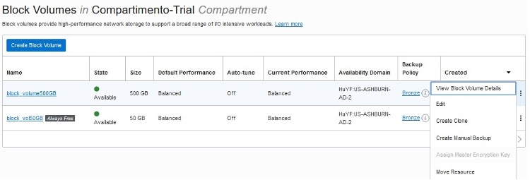  

As opções de backup podem ser facilmente acessadas a partir do "menu
rápido" (três pontos à direita), opção "Assign Backup Policy" onde você
pode escolher a política de backup mais apropriada para seus dados.

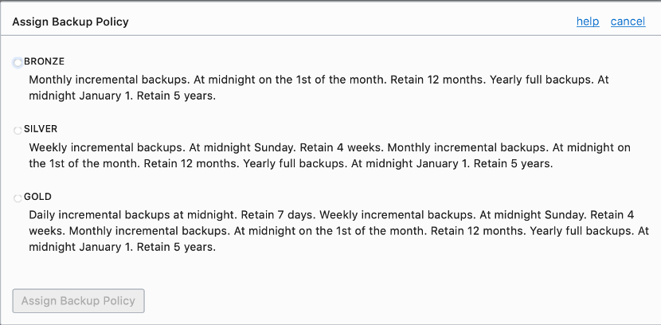

# Lab 5. Object Storage

O serviço Oracle Cloud Infrastructure Object Storage é uma plataforma de
armazenamento de alto desempenho em escala de internet que oferece
durabilidade de dados confiável e econômica. O serviço Object Storage
pode armazenar uma quantidade ilimitada de dados não estruturados de
qualquer tipo de conteúdo, incluindo dados analíticos e conteúdo
avançado, como imagens e vídeos.

Com o serviço Object Storage, você pode armazenar e recuperar dados de
forma segura e protegida diretamente da internet ou de dentro da
plataforma de nuvem. O serviço Object Storage oferece várias [interfaces
de
gerenciamento](https://docs.oracle.com/pt-br/iaas/Content/Object/Concepts/objectstorageoverview.htm#accessways)
que permitem gerenciar facilmente o armazenamento em escala. A
elasticidade da plataforma permite que você comece em pequena escala e
dimensione perfeitamente, sem prejudicar o desempenho ou a
confiabilidade do serviço.

O Object Storage é um serviço regional e não está vinculado a nenhuma
instância de computação específica. Você pode acessar dados de qualquer
lugar dentro ou fora do contexto do Oracle Cloud Infrastructure, desde
que tenha conectividade com a internet e possa acessar um dos pontos
finais do serviço [[Object
Storage]{.underline}](https://docs.oracle.com/iaas/api/#/en/objectstorage/latest/).

**Tiers do Object Storage**

**Standard (HOT)**

A camada **Padrão** é a camada de armazenamento padrão principal usada
para dados do serviço [[Object
Storage]{.underline}](https://docs.oracle.com/pt-br/iaas/Content/Object/Concepts/objectstorageoverview.htm#Overview_of_Object_Storage).
A camada de armazenamento Padrão é o armazenamento \"dinâmico\" usado
para dados que você precisa acessar com rapidez, imediatamente e
frequência. A acessibilidade dos dados e o desempenho justificam um
preço mais alto para armazenar dados no nível Standard.\
Alguns casos de uso principais da camada de armazenamento Padrão incluem
o seguinte:

-   Repositório de conteúdo para dados escaláveis, imagens, logs e vídeo
    acessíveis

-   Repositório para backups acessíveis

-   Repositório de dados para dados do Hadoop/big. Fornece uma
    plataforma de armazenamento escalável para armazenar conjuntos de
    dados de grande porte e operar com perfeição nesses conjuntos de
    dados. O [Conector HDFS para o Serviço Object
    Storage](https://docs.oracle.com/pt-br/iaas/Content/API/SDKDocs/hdfsconnector.htm#hdfs)
    oferece conectividade com vários mecanismos de análise de big data,
    como Apache Spark e MapReduce. Essa conectividade permite que os
    mecanismos de análise trabalhem diretamente com dados armazenados no
    serviço Object Storage. Para obter mais informações, consulte
    [Suporte a
    Hadoop](https://docs.oracle.com/pt-br/iaas/Content/Object/Tasks/hadoopsupport.htm#Hadoop_Support).

**Infrequent Access (COOL)**

A camada **Acesso Não Frequente** é um armazenamento \"resfriado\" usado
para dados que você acessa com pouca frequência, mas que deve estar
disponível imediatamente quando necessário. Os custos de armazenamento
são menores do que **Padrão**.

Se você estiver carregando um objeto em um bucket de camada de
armazenamento padrão Padrão, poderá atribuir explicitamente o objeto à
camada de armazenamento Infrequent Access de menor custo.

A camada Acesso Não Frequente tem um período mínimo de retenção de
armazenamento e taxas de recuperação de dados:

-   O período mínimo de retenção de armazenamento para a camada de
    Acesso Não Frequente é de 31 dias. Se você excluir ou substituir
    objetos na camada Acesso Não Frequente antes que os requisitos de
    retenção sejam atendidos, será cobrado o custo rateado de armazenar
    os dados pelos 31 dias completos.

-   Quando você precisar acessar objetos armazenados nesta camada, será
    cobrada uma taxa de recuperação de dados por GiB.

Alguns casos de uso principais da camada de armazenamento do Infrequent
Access incluem o seguinte:

-   Backups de dados locais

-   Repositório para backups raramente acessados

-   Armazenamento para dados replicados ou copiados de outra região

**Archive (COLD)**

A camada **Arquivo Compactado** é a camada de armazenamento padrão
principal usada para dados do serviço [Archive
Storage](https://docs.oracle.com/pt-br/iaas/Content/Archive/Concepts/archivestorageoverview.htm#Overview_of_Archive_Storage).
A camada de armazenamento de arquivos compactados é um armazenamento
\"frio\" usado para dados raramente ou que raramente acessam, mas que
deve ser retido e preservado por longos períodos.\
\
Os objetos na camada Arquivo Compactado devem ser restaurados antes de
estarem disponíveis para acesso. A economia da camada Arquivo Compactado
compensa o lead time necessário para acessar os dados. No entanto, a
camada Archive tem um período mínimo de retenção de armazenamento e
algumas taxas de armazenamento adicionais:

-   O período mínimo de retenção de armazenamento para a camada de
    Arquivo Compactado é de 90 dias. Se você excluir ou substituir
    objetos na camada Arquivo Compactado antes que os requisitos de
    retenção sejam atendidos, será cobrado o custo rateado de armazenar
    os dados pelos 90 dias completos.

-   Ao restaurar objetos, você está retornando esses objetos para a
    camada Padrão para acesso. Você será cobrado pela camada de classe
    Padrão enquanto os objetos restaurados residirem nessa camada.

Alguns casos de uso principais da camada de armazenamento de Arquivos
Compactados incluem o seguinte:

-   Requisitos de conformidade e auditoria

-   Análise de dados de log retroativo para determinar o padrão de uso
    ou para depurar problemas

-   Dados do repositório de conteúdo histórico ou raramente acessados

-   Dados gerados pelo aplicativo que exigem arquivamento para análise
    futura ou para fins legais

Objetivo

-   Criar um Site estático utilizando um Bucket público

# [EXERCÍCIO 5: Criar um Object Storage e um site estático]

 **PASSO 1** -- Acesse a tela de Object Storage através do menu principal \>Object Storage e Archive Storage\> Buckets                
                                                                       
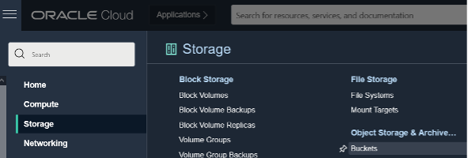                                                     
                                                                       
 **PASSO 2** -- Selecione o compartimento desejado e clique em "Create 
 Bucket"                                                               
                                                                       
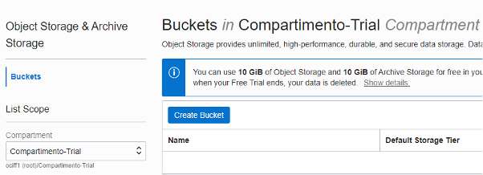                                                    
                                                                       
 **PASSO 3** -- Crie os Buckets com as seguintes configurações:          
                                                                       
 > **Bucket Name**: bucket-site                                        
 >                                                                     
 > **Default Storage Tier**: Standard                                  
 >                                                                     
 > **Enable Object Versioning**: V    

 > **Bucket Name**: dataflow-logs                                    
 >                                                                     
 > **Default Storage Tier**: Standard                                  
 >                                                                     
 > **Enable Object Versioning**: V 

 > **Bucket Name**: dataflow-warehouse
 >                                                                     
 > **Default Storage Tier**: Standard                                  
 >                                                                     
 > **Enable Object Versioning**: V 

 > **Bucket Name**: raw-data
 >                                                                     
 > **Default Storage Tier**: Standard                                  
 >                                                                     
 > **Enable Object Versioning**: V 

                                                                       
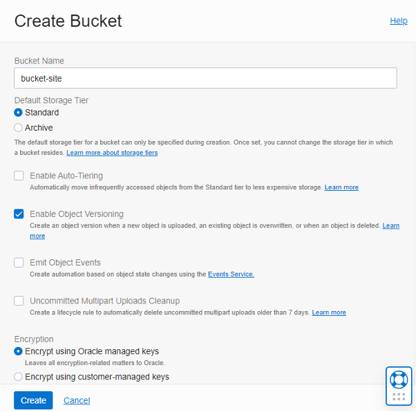     
                                                                       
 **PASSO 3** -- A criação será instantânea e você já verá as           
 informações do seu Bucket:                                            
                                                                       
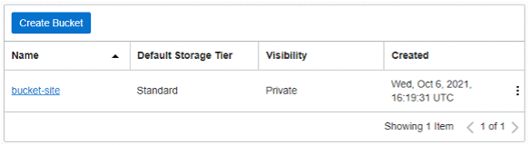                                      
                                                                       
 Selecione o seu novo bucket para ver suas configurações               
                                                                       
 **PASSO 4** -- Agora, vamos alterar a visibilidade do bucket de       
 "Privado" para "Público":                                             
                                                                       
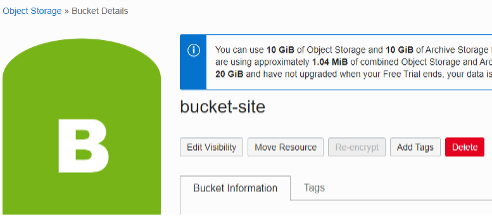                                        
                                                                       
 **Não deixe habilitada** a opção de liberar para os usuários listarem 
 os objetos do bucket                                                  
                                                                       
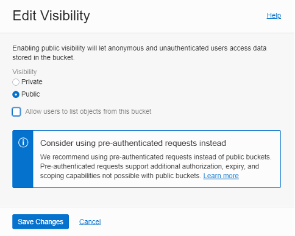                                         
                                                                       
 Salve as alterações                                                   
                                                                       
 **PASSO 5** -- Faça o UPLOAD do arquivo "index.html" presente no      
 material de apoio deste workshop.                                     
                                                                       
 Para fazer UPLOAD de arquivos diretamente da console, basta clicar no 
 botão Upload e selecionar o arquivo.  

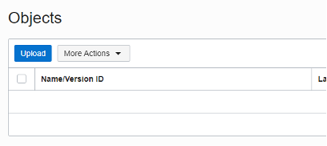                                     
                                                                       
 Não será necessário preencher nenhum campo. Apenas selecione o        
 arquivo e faça o upload                                               
                                                                       
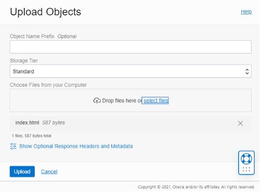                                         
                                                                       
 **PASSO 6** -- O arquivo aparecerá na sessão Objects do seu Bucket.   
 Agora para puxar o endereço https deste recurso basta selecionar os 3 
 pontos na lateral do objeto e selecionar "View Object Details"        
                                                                       
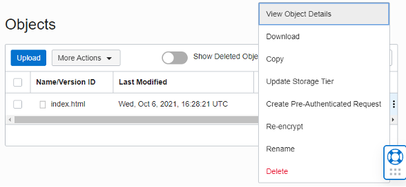                                   
                                                                       
 **PASSO 7** -- Copie o endereço HTTP abaixo e cole no seu browser     
 para ver o seu site estático funcionando.                             
                                                                       
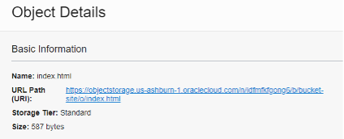                                       
                                                                       
 Seu site está pronto, agora basta fazer o apontamento em seu DNS      

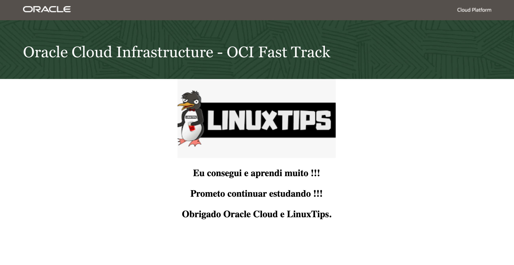  

# Lab 6. Serviço de File Storage

**File Storage**

O servi o OCI File Storage oferece um sistema de arquivos de 
rede de n vel empresarial duravel, escalonavel e seguro. 
Voce pode se conectar a um sistema de arquivos de servico de
armazenamento de arquivos a partir de qualquer bare metal, 
maquina virtual ou instancia de container em sua VCN. 
Voce tambem pode acessar um sistema de arquivos de fora do VCN
usando o Oracle Cloud Infrastructure FastConnect e a VPN com 
segurança do protocolo da Internet (IPSec).

O uso do servico de armazenamento de arquivos requer a compreensao 
dos seguintes conceitos, incluindo alguns que pertencem ao 
Oracle Cloud Infrastructure Networking:

-   Mount Target:
    Um endpoint NFS que reside em uma sub-rede de sua escolha e possui alta disponibilidade. 
    O Mount Target fornece o endere o IP ou nome DNS que é usado no comando de montagem para 
    conectar NFS clients a um File System. Um único Mount Targent pode servir como endpoint 
    de muitos File Systems.

-   Export:
   O Export controla como os clientes NFS acessam os File Systems quando se conectam a um 
   Mount Target. 
   Os File Systems são exportados (disponibilizados) por meio de Mount Targets. 
   Cada Mount Target mantém um conjunto de exportaçõs que contém uma ou várias exportações.

Objetivos

> • Criar um FileStorage Service File System, e acessa-lo através de uma instância Linux.

**Criando um File Storage Service File System**

# [EXERCÍCIO 6: Criando um volume de File Storage]
**PASSO 1 -** Acesse a tela de FileStorage através de Storage>File Storage.                                       
                                                                      
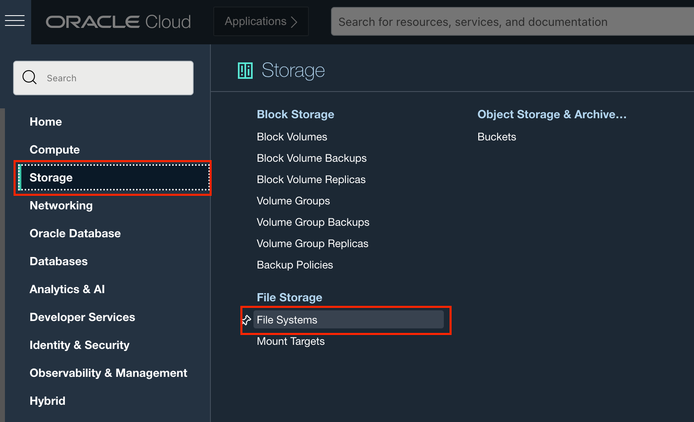
                                                                      
**PASSO 2 -** Clique em create file system:    

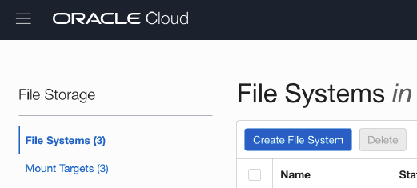

**PASSO 3 -** Clique em create file system: 

Você verá uma tela pop-up solicitando as principais informações 
para identificar o FileStorage Service. Use o botão editar.

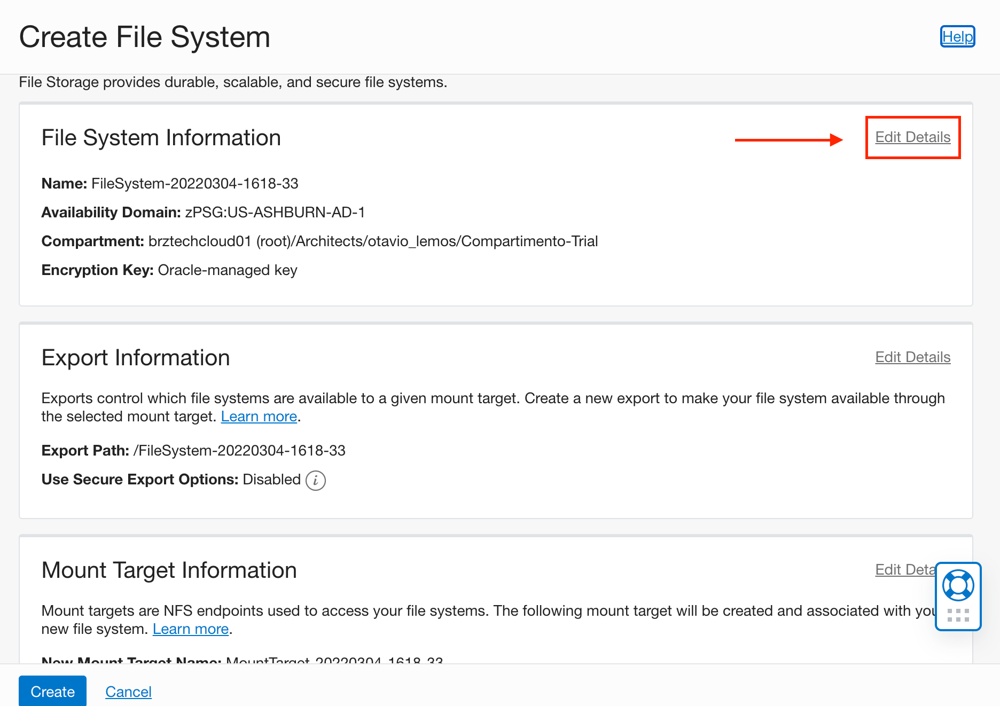

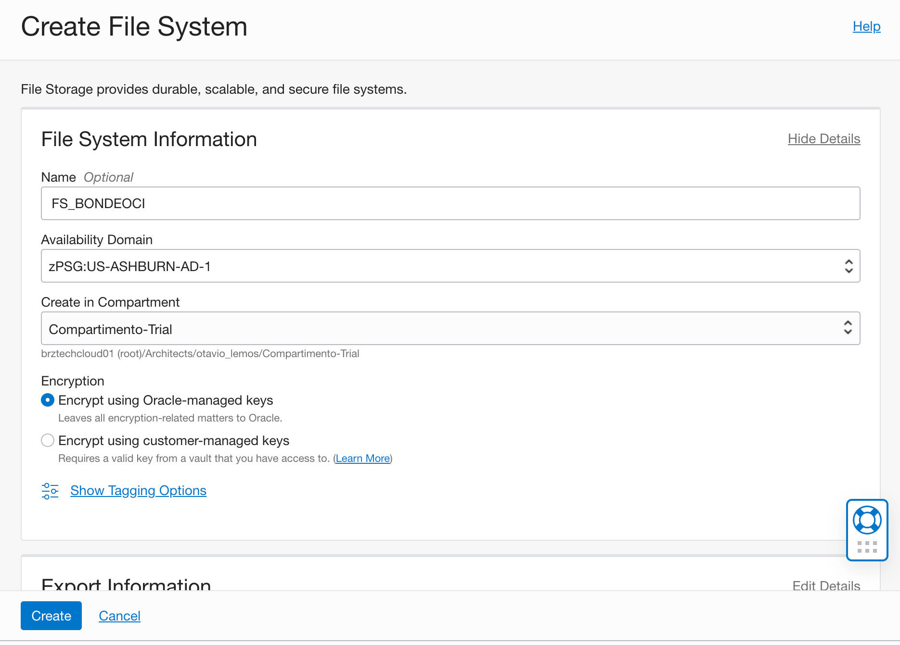

**PASSO 4 -** Selecione sua VCN e a Sub-rede Pública:

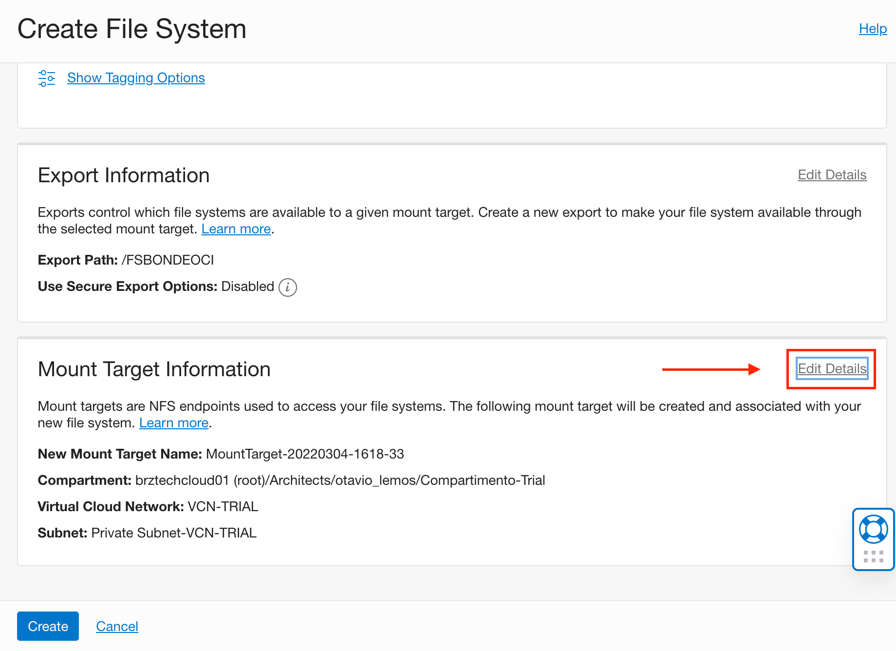

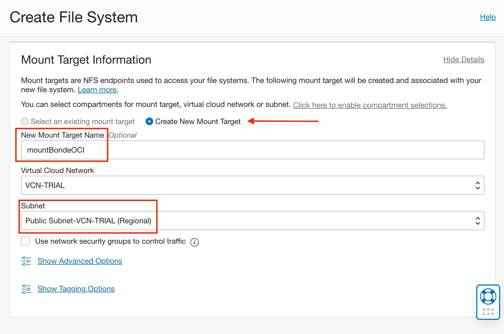

**PASSO 5 -** Libere as regras de firewall:

Observe que FileStorage é um serviço de rede e, como tal, seu uso está subordinado as regras de firewall. 
Para montar o Mount Target criado, vamos criar uma regra de segurança (Security Rule) de entrada (Ingress), 
para permitir o tráfego IP do serviço FileStorage.

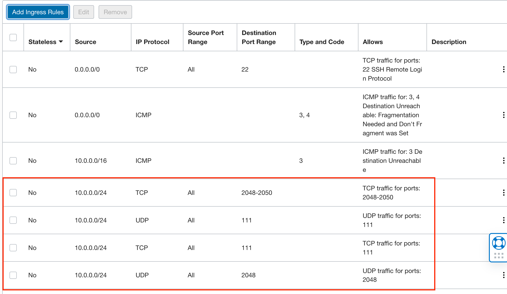

Selecione a subnet onde o Mount Target foi anexado.
Em: Menu principal >Networking > Virtual Cloud Networks, Clique em sua VCN e 
depois selecione a Subnet onde o Mount Target foi anexado, “Public Subnet”.
Clique em “Default Security List” e depois clique no botão “Add Ingress Rules” 
e crie as regras de entrada abaixo:

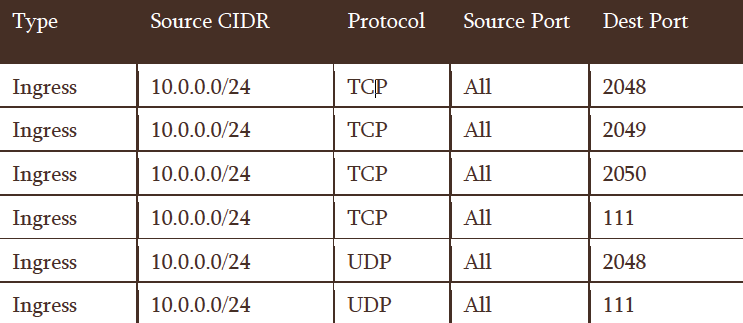

**PASSO 6 -** Menu Exports:

Selecione o Mount Target criado através do menu principal >File Storage> Mount Target, no menu de ações “Export’s”,
selecione “Mount Commands” e você terá informações de montagem:

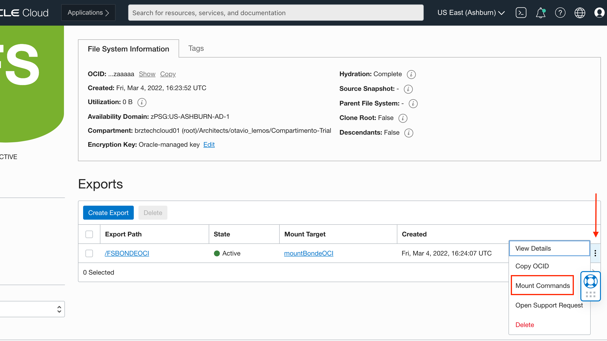

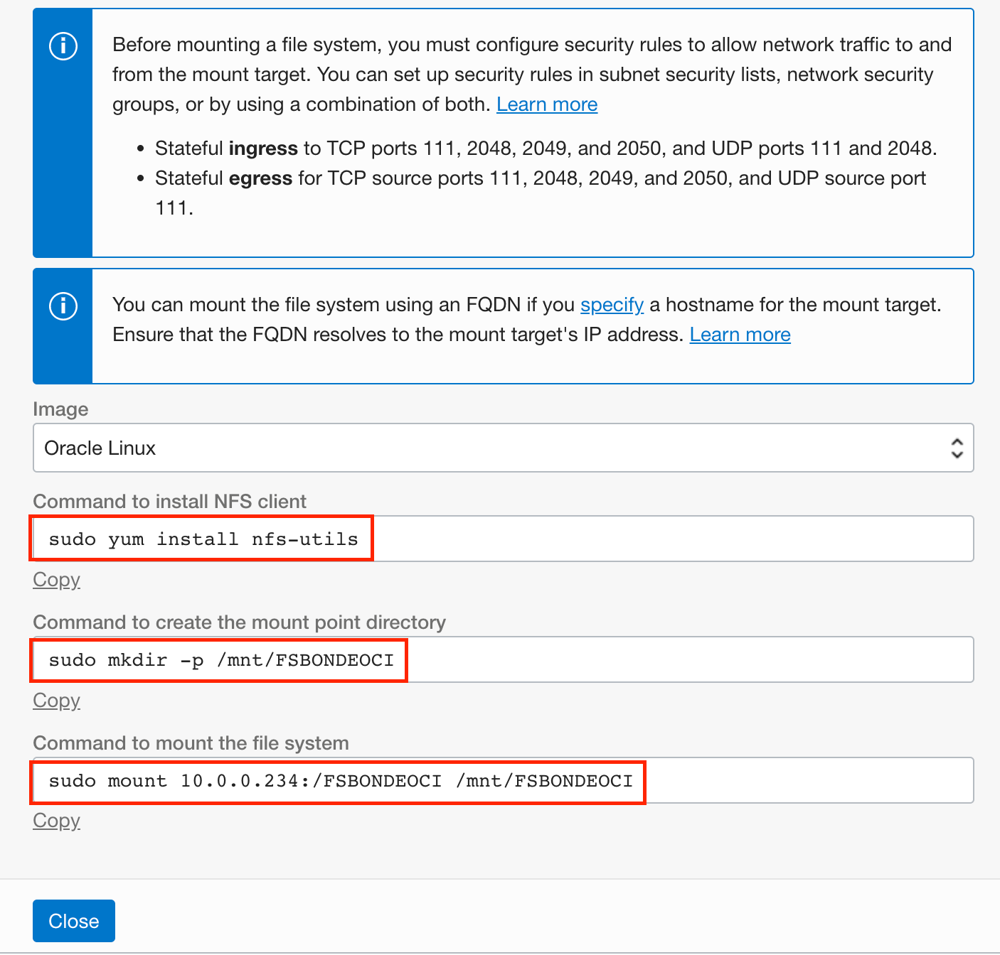

**PASSO 7 -** Montagem no GNU/Linux:

Acesse sua VM Linux criada e execute o comando de montagem disponibilizado pelo OCI. 
Após os commandos de montage verifique o file storage contendo 8E 
disponível através do comando "df -h".

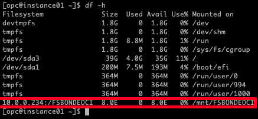

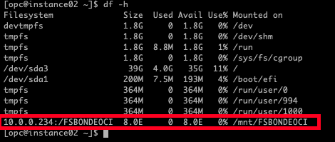

